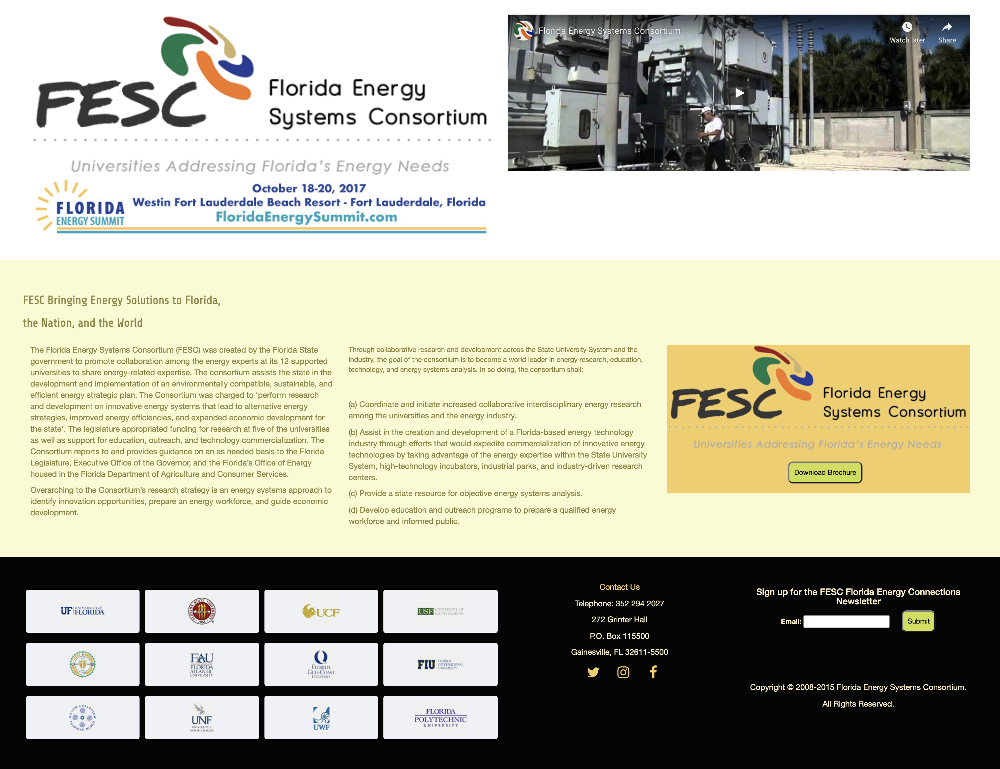

# fesc-redesign
> a mock up redesign project of the original [FESC website](http://floridaenergy.ufl.edu/)

## Table of contents
* [General info](#general-info)
* [Screenshots](#screenshots)
* [Technologies](#technologies)
* [Setup](#setup)
* [Features](#features)
* [Status](#status)
* [Inspiration](#inspiration)
* [Contact](#contact)

## General info
The goal of this project is to make the FESC website to have a consistent theme and be responsive. Just as a proof of concept, the homepage, research page, and the contact page are redesigned. In addition to sematic HTML, Sass is used for reusable code structure. On the research page, the energy data is obtained via US Energy Information Admistration API and drawn using Google Chart library. Lastly, Vue.js is used to create a template and applied on the sub-sections of the research page.

## Screenshots

## Technologies
* Sass
* JS
* Vue.JS

## Setup
[Click here to go to website](https://minyaotan.github.io/fesc-redesign)

## Features
Redesign of the following pages
* Home
* Research
* Contact

## Status
Project is finished.

## Inspiration
Project content is based on the [FESC website](http://floridaenergy.ufl.edu/)

## Contact
Created by Cheryl Tan